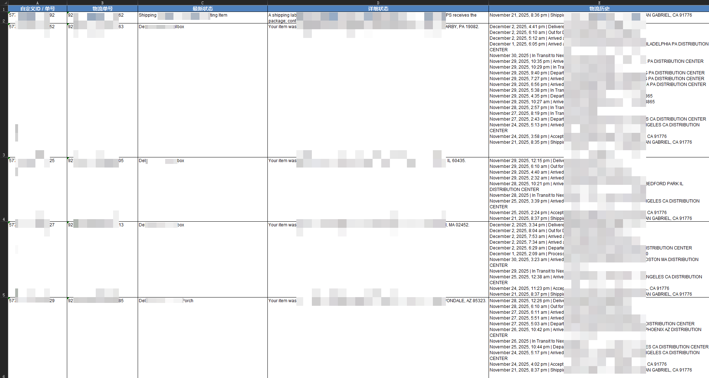

# USPS 批量物流追踪器 (Auto USPS Tracker)

[简体中文](./README.md) | [English](./README_en.md)

**`USPS 批量物流追踪器` 是一款专为跨境电商卖家和需要大量追踪USPS包裹的用户设计的桌面应用。它能全自动、批量地从USPS官网抓取物流信息，并生成格式精美的Excel报告。**

您是否还在为手动查询成百上千个USPS订单的物流状态而烦恼？本项目致力于将这一繁琐、耗时的工作流程简化为一键操作，极大提升您的工作效率。

  
   
  <em>(点击封面图跳转到 B 站观看高清演示视频)</em>

---

## ✨ 核心功能

-   **📦 大批量并发查询**: 支持一次性输入数千个物流单号，程序会自动分批次、多进程执行查询任务，最大化利用网络和CPU资源。
-   **🛡️ 智能防屏蔽抓取**:
    -   基于现代化的 **Playwright** 框架，模拟真实浏览器环境。
    -   内置高级“Stealth”反屏蔽技术，有效绕过Cloudflare等网站的机器人检测，确保查询稳定、成功率高。
-   **📋 详尽信息提取**:
    -   不仅获取包裹的**最新状态**（如“Delivered”, “In Transit”），还抓取**详细的状态描述**和**完整的物流历史轨迹**。
    -   自动处理查询失败或单号无效的情况，并在报告中清晰标注。
-   **📊 精美Excel报告导出**:
    -   自动将所有查询结果整理并导出为 `.xlsx` 格式的Excel文件。
    -   报告经过专业排版，包含**带颜色的表头、内容自动换行、边框**，并能**根据内容自适应调整列宽**，清晰易读。
-   **🌐 代理支持与简洁界面**:
    -   支持配置HTTP代理服务器，轻松应对复杂的网络环境。
    -   提供简洁直观的图形用户界面（GUI），所有操作一目了然，无需任何编程知识。

## 📸 软件截图

  
   
  <em>软件主界面：简洁的设计，强大的功能。</em>

  
   
  <em>导出表格展示：清晰、美观的风格。</em>

## 🚀 快速开始

### 系统要求

-   **操作系统**: Windows 10 或更高版本。
-   **浏览器**: 已安装 Google Chrome 浏览器。

### 安装与运行

-   **下载链接**：https://download.llxoxll.com/latest/yanqu_usps_tracker

## 📂 我的其他开源项目

-   **[AI-Trader-For-MT4](https://github.com/toki-plus/ai-trader-for-mt4)**: 革命性开源框架，将大语言模型（LLM）转变为能在MetaTrader 4（MT4）平台上进行自主交易的AI代理。
-   **[AI Mixed Cut](https://github.com/toki-plus/ai-mixed-cut)**: 一款颠覆性的AI内容生产工具，通过“解构-重构”模式将爆款视频解构成创作素材库，并全自动生成全新原创视频。
-   **[AI Highlight Clip](https://github.com/toki-plus/ai-highlight-clip)**: AI驱动的智能剪辑工具，全自动从长视频分析、提取“高光时刻”，并生成爆款标题。
-   **[AI Video Workflow](https://github.com/toki-plus/ai-video-workflow)**: 全自动AI原生视频生成工作流，集成文生图、图生视频和文生音乐模型，一键创作AIGC短视频。
-   **[AI TTV Workflow](https://github.com/toki-plus/ai-ttv-workflow)**: AI驱动的文本转视频工具，自动将文案转化为带配音、字幕和封面的短视频，支持文案提取/二创/翻译。
-   **[AB Video Deduplicator](https://github.com/toki-plus/AB-Video-Deduplicator)**: 创新“高帧率抽帧混合”技术，重构视频数据指纹，规避短视频平台原创度检测/查重机制。
-   **[Video Mover](https://github.com/toki-plus/video-mover)**: 全自动化内容创作流水线，自动监听下载视频、多维度去重、AI生成标题，一键发布多平台。

## 🤝 参与贡献

欢迎任何形式的贡献！如果你有新的功能点子、发现了Bug，或者有任何改进建议，请：
-   提交一个 [Issue](https://github.com/toki-plus/auto-usps-tracker/issues) 进行讨论。
-   Fork 本仓库并提交 [Pull Request](https://github.com/toki-plus/auto-usps-tracker/pulls)。

如果这个项目对你有帮助，请不吝点亮一颗 ⭐！
